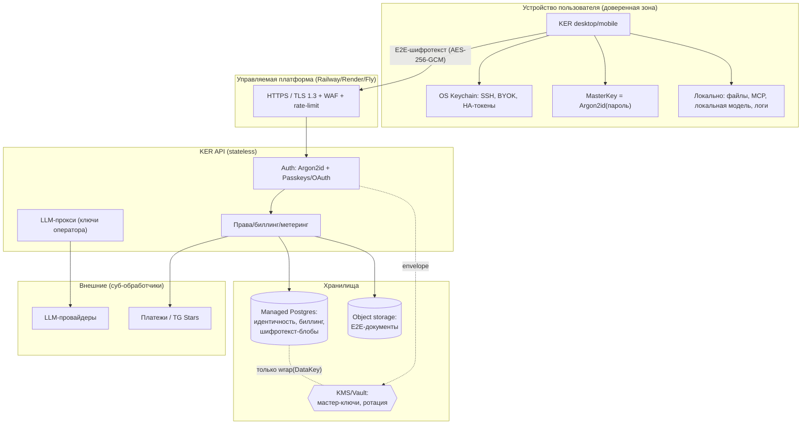

# K.E.R. — Архитектура безопасности хранения данных

> Аудит и целевая архитектура. Составлено как security-review уровня ASVS L2/L3.
> Документ отделяет **«как в KER сейчас»** от **«как должно быть»** и даёт
> поэтапный план. Принцип номер один: *нельзя утечь тем, чего у тебя нет.*

## 0. Модель угроз (кратко)

Считаем реалистичный худший случай: **полная компрометация сервера** — злоумышленник
получил дамп базы, переменные окружения и доступ к процессу. Цель архитектуры —
чтобы в этом случае он получил **минимум**: идентификаторы и биллинг, но не
переписку, не память ассистента, не ключи пользователей, не пароли.

Активы, ранжированные по чувствительности:

| Актив | Чувствительность | Кто «владелец» ключа |
|---|---|---|
| Пароли | критично | никто (только верификатор-хэш) |
| API-ключи провайдеров пользователя (BYOK), токены умного дома, SSH | критично | **устройство пользователя** |
| Память ассистента, история чатов, документы | высокая | **пользователь** (E2E) |
| Голос (аудио) | высокая | не хранить |
| Идентичность (username, tg id), биллинг, лимиты | средняя | сервер |
| Наши токены входа / API-ключи KER | средняя | сервер (только хэш) |

---

## 1. Что вообще должно храниться на сервере

Только то, без чего сервер не может выполнять свою функцию (аутентификация,
биллинг, метеринг прокси):

- **Идентичность**: `username`, `telegram_user_id`, `password_verifier` (хэш), флаги `active`/`telegram_verified`.
- **Биллинг и права**: тариф/лицензия, счётчики использования (сообщения, токены прокси), даты.
- **Наши секреты в виде хэшей**: токены входа, API-ключи KER, ключи лицензий — **только SHA-256/HMAC-хэш**, не сам секрет.
- **Зашифрованные «слепые» блобы** пользовательских данных (память/чаты/документы), которые сервер **хранит, но не может прочитать** (см. §4).

Всё остальное — либо на устройстве, либо вообще не хранится.

## 2. Что лучше не хранить вообще

- **Пароли в открытом виде** — никогда (в KER и не хранятся).
- **Голосовое аудио** — обрабатывать в потоке (STT) и **удалять**; не писать на диск.
- **Сырые запросы к моделям дольше, чем нужно** — прокси не должен логировать тела запросов/ответов.
- **SSH-ключи, пароли от чужих систем** — сервер к ним прикасаться не должен (см. §3).
- **Полные логи с PII** — маскировать (в KER уже есть редакция секретов в памяти).
- **Платёжные данные карт** — не касаться (только через провайдера/Stars → PCI-scope = 0).

## 3. Что должно жить только на устройстве пользователя (никогда на сервере)

KER это уже разделяет: капабилити `pc_access`, `mcp`, `local_ai`, `logs` помечены
как **LOCAL_ONLY** (`jarvis/billing/entitlements.py`) — они исполняются на машине
пользователя, сервер вызова не видит. К этому же классу относятся:

- Доступ к файлам / терминалу / рабочему столу, конфиг MCP-серверов.
- **SSH-ключи** → только в OS-хранилище устройства (Keychain / DPAPI / libsecret), никогда в облако.
- Токены умного дома (Home Assistant) и **BYOK-ключи провайдеров** — хранить на устройстве в OS keychain; на сервер отправлять только если E2E-зашифрованы (§4).

## 4. Что должно быть E2E-зашифровано (Zero-Knowledge)

Самое ценное. Сервер хранит **шифротекст** и физически **не может** расшифровать —
ключ выводится из секрета пользователя и на сервер не попадает:

- **Память ассистента** (факты, эмбеддинги), **история чатов**, **документы** пользователя.
- **BYOK-ключи провайдеров**, **токены умного дома**, любые пользовательские секреты, если пользователь всё же хочет синхронизацию между устройствами.

**Схема (клиент-сайд):**
1. Из пароля/passphrase пользователя выводим `MasterKey = Argon2id(password, salt)` — **на устройстве**.
2. `MasterKey` шифрует случайный `DataKey` (обёртка). На сервере лежит только `wrap(DataKey)` и соль.
3. Данные шифруются `AES-256-GCM` на `DataKey` **до отправки**. Сервер видит только `{nonce, ciphertext, tag}`.
4. Смена пароля → перешифровываем только обёртку `DataKey`, не все данные.

Компромисс, который надо назвать честно: **LLM-прокси видит текст запроса** в момент
инференса (иначе модель не ответит). Поэтому «API от меня» и E2E-память — разные
контуры: память/история/документы могут быть Zero-Knowledge, но *содержимое живого
запроса к модели* проходит через сервер и провайдера. Для максимальной приватности —
локальная модель (`local_ai`, Pro), тогда запрос не покидает устройство.

## 5. Как правильно хранить каждый тип

| Данные | Правильно | Сейчас в KER | Разрыв |
|---|---|---|---|
| Пароли | **Argon2id** (m=64MB, t=3, p=1), соль на юзера | ✅ **Argon2id** (scrypt fallback), апгрейд старых при входе | — |
| Наши токены входа | случайные, хранить **хэш** (SHA-256/HMAC), TTL, revoke | ✅ так и есть | — |
| API-ключи KER (юзерам) | хэш + короткий префикс для показа, мгновенный revoke | ✅ так и есть | — |
| OAuth-токены (KER как клиент провайдера) | access — только в памяти/кратко; **refresh — AES-256-GCM + KMS**, ротация | нет OAuth-клиента | ввести при OAuth-входе |
| Refresh tokens | шифровать (envelope/KMS), привязка к устройству, ротация с детекцией повторного использования | — | фаза 2 |
| Cookies (если веб) | `HttpOnly; Secure; SameSite=Strict`, подпись, короткий TTL | API на Bearer (кук нет) | при веб-дашборде |
| SSH-ключи | **только на устройстве**, OS keychain; сервер — никогда | не хранятся на сервере | держать так |
| Память ассистента | E2E (§4); минимум — AES-256-GCM на сервере под KMS-ключом | SQLite/JSON в открытом виде | at-rest есть для документов → распространить + E2E |
| Документы | AES-256-GCM at-rest, ключ из секрет-менеджера | ✅ **AES-256-GCM** (`KER_DATA_KEY`), scoping по principal | E2E — фаза 2 |
| История чатов | E2E или локально; retention-политика + авто-удаление | зависит от деплоя | шифрование + retention |
| Голос | не хранить: STT в потоке → выбросить | не персистится | держать так |

## 6. Где какой примитив

- **Argon2id** — хэширование паролей (память-hard, устойчив к GPU/ASIC). Библиотека `argon2-cffi`.
- **AES-256-GCM** — шифрование данных at-rest (память, чаты, документы, refresh-токены). AEAD: конфиденциальность + целостность, уникальный nonce на запись.
- **KMS / Vault** (AWS KMS, GCP KMS, HashiCorp Vault) — **envelope encryption**: сервер хранит шифротекст и `wrap(DataKey)`, мастер-ключ живёт в KMS. Дамп БД без KMS = мусор. Плюс ротация и аудит доступа к ключам.
- **Passkeys / WebAuthn** — предпочтительный вход (нет пароля → нечего фишить и утекать). OAuth (Telegram Login, Google) — для «войти через…». Пароль оставить как fallback, но на Argon2id.

## 7. Как выжать минимум пользы для атакующего при полном взломе

1. **Data minimization** — не хранить лишнего (§1–2). Меньше данных → меньше ущерб.
2. **Envelope encryption через KMS** — в БД только шифротекст; ключи в KMS с отдельными правами. Компрометация БД ≠ компрометация данных.
3. **E2E для самого ценного** — сервер в принципе не может расшифровать память/чаты (§4).
4. **Изоляция арендаторов** — всё scoping по `principal` (в KER уже: память, документы, лимиты).
5. **Короткоживущие токены** + revoke + ротация; никаких вечных секретов в БД.
6. **Секреты — не в БД и не в git** — только в KMS/Vault/секрет-менеджере платформы. (В KER уже есть guard от коммита токенов.)
7. **Least privilege** — сервисные аккаунты с минимумом прав; отдельная роль на чтение/запись БД.
8. **Провайдерские ключи оператора (прокси)** — в секрет-менеджере, не в образе; ротация.

## 8. Соответствие стандартам

- **OWASP ASVS L2** (цель для продукта): V2 (аутентификация — Argon2id, MFA/passkeys), V3 (сессии — TTL, revoke), V6 (криптография at-rest), V7 (логи без PII), V8 (защита данных), V9 (TLS везде).
- **NIST 800-63B** — требования к паролям/аутентификаторам (длина вместо навязанной сложности, проверка по спискам утечек, rate-limit).
- **GDPR** — законное основание, **минимизация**, право на удаление (`clear()`/`forget` уже есть), экспорт, шифрование, уведомление об инциденте **≤72 ч**, DPA с суб-обработчиками (провайдеры LLM!), при необходимости — EU-представитель.
- **TLS 1.2+ везде** (сейчас у тебя http — это первый разрыв, закрывается доменом + Caddy/Let’s Encrypt).

## 9. Юридическая и техническая минимизация ответственности

- **Меньше данных — меньше ответственности.** E2E → при утечке утекает шифротекст, часть обязанностей по GDPR смягчается (данные нечитаемы).
- **Документы**: Privacy Policy, Terms of Service, **DPA** (обработка данных), список суб-обработчиков (OpenAI/Anthropic/OpenRouter, хостинг, платежи).
- **Согласие** на обработку и на передачу запросов провайдерам LLM (это трансграничная передача — назвать её явно).
- **План реагирования на инцидент** + журнал доступа (audit log в KER уже есть).
- **Ретеншн-политика** и авто-удаление; аккаунт удаляется полностью по запросу.
- **Кибер-страховка** и, при росте, независимый пентест / SOC 2.

## 10. Рекомендуемая архитектура для KER

**Пояснение к потокам:**
- Устройство — единственная зона, где данные в открытом виде. Пароль → `Argon2id` → `MasterKey`, который защищает `DataKey`; шифрование `AES-256-GCM` **до** отправки.
- Платформа даёт TLS/HTTPS и домен (закрывает текущий http-разрыв) + рейт-лимит.
- API stateless: аутентификация, права, прокси. Хранит идентичность + биллинг + **шифротекст**.
- Postgres (managed) — «не у тебя»: бэкапы, доступы, шифрование дисков платформой.
- KMS хранит мастер-ключи отдельно от БД → дамп БД бесполезен.
- Прокси использует ключи **оператора** и не логирует тела запросов; провайдер видит только сам запрос в момент инференса (для полной приватности — локальная модель).

---

## Что уже хорошо в KER

- Пароли — **Argon2id** (m=64MB, t=3, p=1), scrypt как fallback, старые PBKDF2 апгрейдятся при входе. Все секреты — **только хэши** (токены/ключи — SHA-256).
- **AES-256-GCM at-rest** для содержимого документов, ключ из `KER_DATA_KEY` (никогда в исходниках), AAD привязывает шифротекст к владельцу.
- API-ключи: хэш + префикс, мгновенный **revoke**.
- Изоляция по `principal` (память, документы, лимиты).
- LOCAL_ONLY-капабилити: PC/MCP/локальная модель не уходят на сервер.
- Редакция секретов в памяти, audit-log, guard от коммита токенов.

## План внедрения (по приоритету)

1. **TLS/HTTPS** — домен + Caddy/Let’s Encrypt (или PaaS-домен). Закрывает главный текущий риск (открытый http). ⏳ следующий шаг
2. **Argon2id** для паролей (миграция «при следующем входе», без сброса). ✅ **сделано**
3. **Шифрование at-rest** чувствительных данных — AES-256-GCM, ключ из секрет-менеджера. ✅ **сделано для документов**, распространить на память/чаты
4. **Managed Postgres + KMS** (envelope encryption) — данные «не у себя», ключи отдельно.
5. **E2E (Zero-Knowledge)** для памяти/чатов/документов и BYOK-секретов.
6. **Passkeys/OAuth**, retention-политика, Privacy Policy/ToS/DPA.

> Пункты 2 и (частично) 3 уже в коде. Дальше по эффекту: **1 (HTTPS)** — самый
> важный оставшийся быстрый шаг; 4 — средний срок; 5–6 — целевое состояние.
